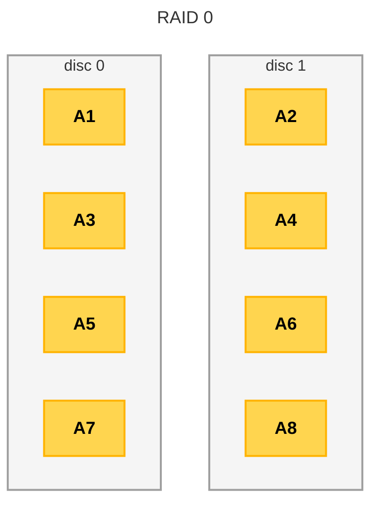
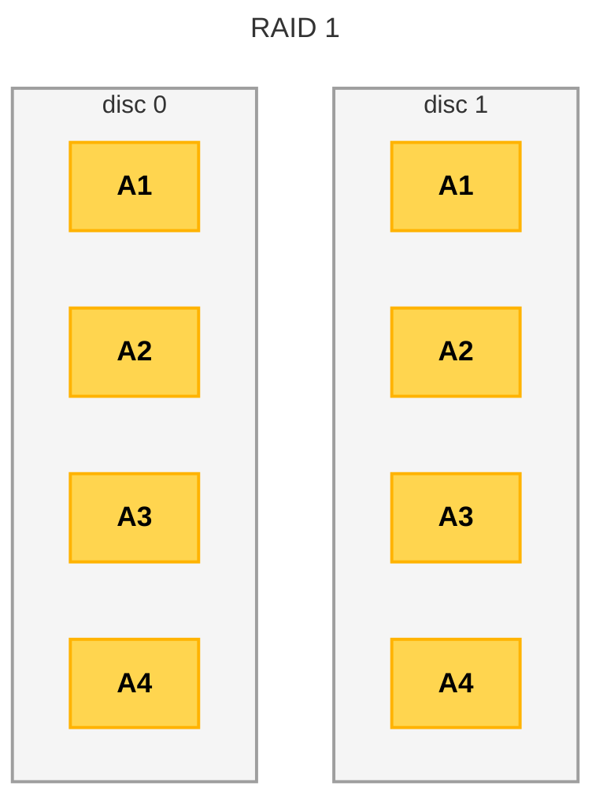
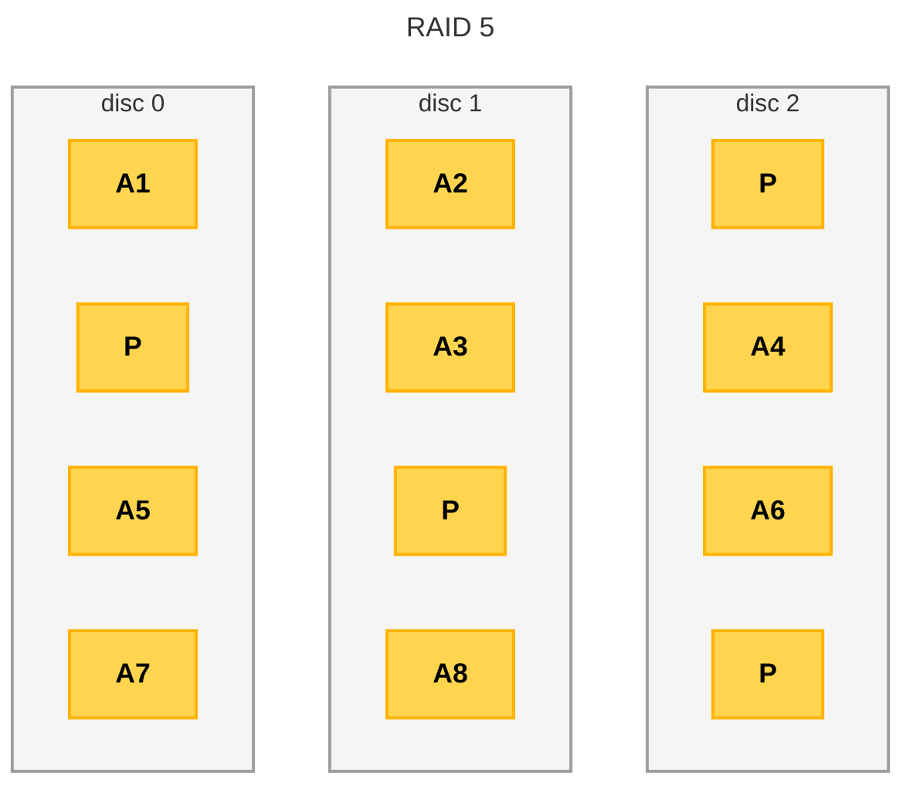
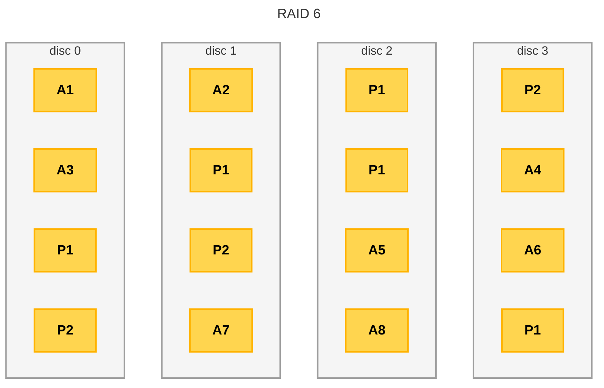
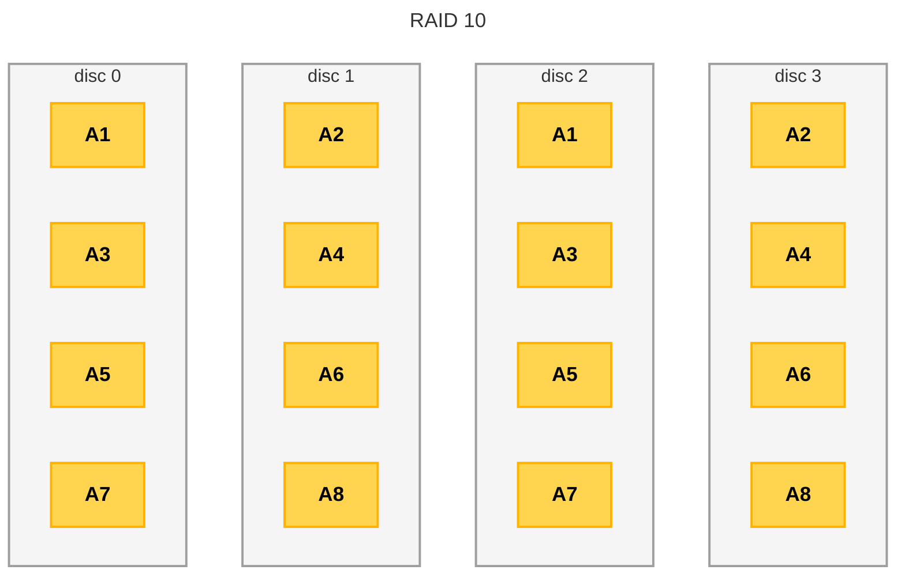

# RA2 · AA2 — Sistemes d'emmagatzematge

*On viuen les dades, i com evitar que hi visquin soles.*

## 1. Medis d'emmagatzematge

La informació s'ha de guardar en medis persistents, és a dir, que conserven les dades encara que l'equip es desconnecti. Als propis ordinadors, els dos medis principals són:

- **Discos durs (HDD)**: tecnologia magnètica, més barata i amb més capacitat per euro, però més lenta i més sensible als cops.
- **Unitats SSD**: basades en semiconductors (memòria flaix), molt més ràpides i resistents als cops, però encara més cares per gigabyte.

A banda d'aquests medis interns, hi ha sistemes externs, considerats un "tercer nivell" d'emmagatzematge: discos durs extraïbles, pendrives, cintes magnètiques i DVD.

## 2. La redundància: no dependre mai d'un sol disc

Duplicar la informació permet evitar-ne la pèrdua davant l'avaria d'un disc. Aquesta duplicació es pot implementar amb diverses tècniques, que sovint es combinen per evitar un únic punt de fallada (*single point of failure*):

- **RAID** (*Redundant Array of Independent Disks*): combina diverses unitats d'emmagatzematge en una sola unitat lògica. És redundància **local**, dins del mateix equip.
- **Sistemes d'emmagatzematge en xarxa**: proporcionen redundància a nivell de xarxa local (més d'un servidor o cabina de discos). Internament, ja fan servir RAID.
- **Serveis de núvol**: com Dropbox, Google Drive o OneDrive, que mantenen la informació "duplicada" a Internet.

## 3. RAID: Redundant Array of Independent Disks

El RAID combina diversos discos o unitats SSD de manera distribuïda. Segons el nivell triat, s'obté:

- **Tolerància a fallades**: si un disc falla, la informació no es perd.
- **Millora del rendiment**: la informació es distribueix entre diversos discos i es pot llegir/escriure en paral·lel.

Es pot implementar amb **maquinari** (controladores dedicades, més ràpid, sol permetre *hot swap*) o amb **programari** (el mateix sistema operatiu, més barat però amb rendiment inferior i només els nivells més bàsics).

### 3.1. RAID 0 — Data striping

Distribueix la informació entre dos o més discos **sense cap redundància**. Com que s'escriu als dos discos alhora, el rendiment augmenta. Si falla un sol disc, es perd TOTA la informació de l'array.

### 3.2. RAID 1 — Mirror

Duplica exactament la mateixa informació entre dos discos. Si un falla, l'altre ja conté tota la informació. Lectura ràpida, escriptura equivalent a un sol disc. Es perd la meitat de la capacitat total.

### 3.3. RAID 5 — Paritat distribuïda

Divideix les dades a nivell de bloc i distribueix la informació de **paritat** entre tots els discos (mínim 3). Redundància més econòmica que el mirall: només es "perd" l'equivalent a un disc. Suporta la pèrdua d'**un** disc.

### 3.4. RAID 6 — Doble paritat

Igual que el RAID 5, però amb una **segona** banda de paritat: suporta la pèrdua de **dos** discos simultàniament. Calen un mínim de quatre unitats.

### 3.5. RAID aniuat (RAID 10)

Combina RAID 1 i RAID 0 (mínim 4 unitats): primer es formen parelles en mirall, i després la informació es distribueix entre les parelles. Ràpid i segur, però només es pot perdre un disc per cada conjunt en mirall.

Altres combinacions són possibles, com el RAID 50 (RAID 5+0) o el RAID 60 (RAID 6+0), tot i que són menys habituals.

### 3.6. Comparativa de nivells de RAID

| Característica | RAID 0 | RAID 1 | RAID 5 | RAID 6 | RAID 10 |
|---|---|---|---|---|---|
| Nombre mínim de discos | 2 | 2 | 3 | 4 | 4 |
| Redundància | No | 1 disc | 1 disc | 2 discos | 1 disc |
| Capacitat utilitzable | 100% | 50% | 1 disc | 2 discos | 50% |
| Velocitat de lectura | Alta | Alta | Baixa | Baixa | Alta |
| Velocitat d'escriptura | Alta | Mitjana | Baixa | Baixa | Mitjana |
| Cost | Baix | Alt | Alt | Molt alt | Alt |

*Font: [www.raid-calculator.com](https://www.raid-calculator.com/raid-types-reference.aspx)*

## 4. Sistemes d'emmagatzematge en xarxa

En un entorn empresarial, les dades no haurien d'estar només a les estacions de treball individuals. Centralitzar-les evita la inconsistència de la informació i facilita fer còpies de seguretat centralitzades. Hi ha tres grans sistemes, de menys a més complexitat: **DAS**, **NAS** i **SAN**.

### 4.1. DAS (Direct Attached Storage)

Servidors que exposen carpetes compartides a la xarxa (SMB o NFS). Pot ser tan bàsic com un servidor normal, o tan avançat com un servidor amb cabines de discos dedicades (*hot-plug*). Inconvenients: rendiment baix si el servidor no és dedicat, disponibilitat limitada, i possible coll d'ampolla de xarxa.

### 4.2. NAS (Network Attached Storage)

Dispositius dedicats exclusivament a l'emmagatzematge en xarxa: petits servidors amb sistema operatiu especialitzat i interfície web de gestió. Molt aptes per al mercat domèstic i la petita empresa. Limitacions de CPU/RAM i possible coll d'ampolla de xarxa.

### 4.3. SAN (Storage Area Network)

Xarxes dedicades exclusivament a l'emmagatzematge, molt més complexes i costoses que un NAS, però amb rendiment molt superior. Utilitzen protocols optimitzats (Fibre Channel, iSCSI, FCoE) diferents dels de la LAN convencional, i requereixen switches i targetes de xarxa específiques. Els servidors s'organitzen en clústers: redundància a nivell de disc (RAID) **i** a nivell de servidor complet.

> 💡 A una escala més petita, es pot muntar un clúster d'emmagatzematge amb servidors normals de la LAN (DAS), amb tecnologies com Windows Server DFS o GlusterFS (Linux), sense la infraestructura cara d'una SAN completa.

## 5. Serveis de núvol

Pagament per ús en lloc d'infraestructura pròpia; fins i tot amb plans gratuïts en entorn domèstic (Google Drive ofereix 15 GB a qualsevol compte de Gmail). Permeten accedir a la informació des de qualsevol lloc, amb un cost inicial baix. Cal valorar-ne, però: la velocitat de sincronització amb fitxers grans, la pèrdua de control complet sobre les dades, i el compliment legal (RGPD) quan hi ha dades personals.

## Resum de l'apartat

- La redundància es pot aconseguir amb RAID (local), emmagatzematge en xarxa, o serveis de núvol.
- RAID 0 dona velocitat sense redundància; RAID 1 dona redundància total a costa de la meitat de la capacitat; RAID 5/6 ofereixen un equilibri amb paritat; RAID 10 combina velocitat i redundància amb més discos.
- DAS < NAS < SAN: complexitat i cost creixents a canvi de més rendiment, disponibilitat i escalabilitat.
- Els serveis de núvol són còmodes i barats, però cal valorar-ne velocitat, control i compliment legal.

## Per saber-ne més

- Repositori ["Materials"](https://github.com/SMX-0226SI/Materials/blob/main/NF2/AA2-SistemesEmmagatzematge.md) (GitHub, SMX-0226SI) — Carlos Alonso Martínez, Escola Pia de Mataró (llicència CC-BY-SA-4.0).
- [raid-calculator.com](https://www.raid-calculator.com/raid-types-reference.aspx) — "RAID Types Reference".
- NASEROS (YouTube) — "Tipos de RAID. En qué se diferencian y cuales son los mejores".
- Pau Tomé (YouTube) — "RAID en Windows Server".
- IBM — ["What is a storage area network (SAN)?"](https://www.ibm.com/think/topics/storage-area-network)

---
*Mòdul 0226 · Seguretat informàtica — CFGM SMX2 — Institut Puig Castellar*
